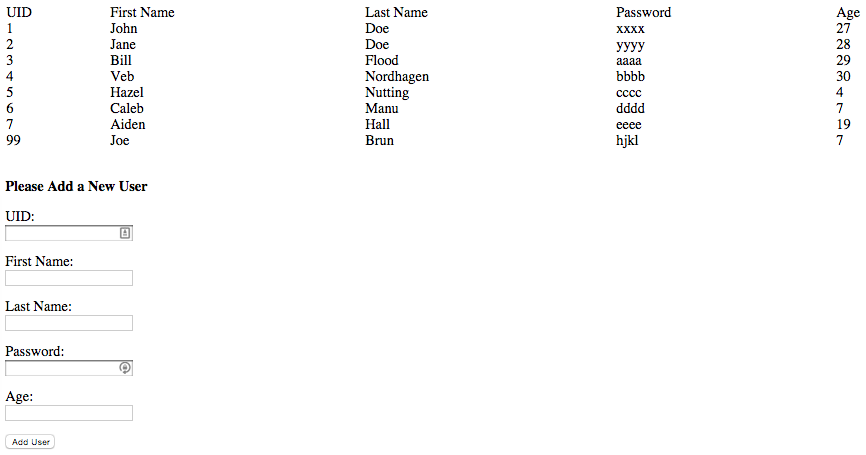

# Workshop: Express and Databases

## Overview

This workshop will exercise your understanding of Express and
Databases. In particular, you will build a simple web service that
will retrieve data from a postgres database and display the results in
a web browser. You will need to create the database, populate the
database with data, and implement the proper routes in Express to view
the data in a browser.

## Prerequisite Knowledge

In order to complete this workshop successfully you will need to
understand the following topics:

* Installation of postgresql.
* Creation of a database.
* SQL for creating a database schema.
* SQL for inserting data into the database.
* SQL for querying the data in the database.
* Installation of the Express web application framework.
* Implementation of Express routes.
* Rudimentary understanding of HTML.
* Basic understanding of HTTP GET and POST requests.
* Basic understanding of HTML forms.

## Part 1: Install Postgres

Your first task is to install the postgres database system. This is
simple as you only need to run the following command:

```bash
$ sudo apt-get update
$ sudo apt-get install postgresql-9.3
$ sudo apt-get install g++
$ sudo apt-get install postgresql-server-dev-9.3
```

## Part 2: Create the Users Database

The next step is to create the users database. This will require you
to login to postgres as the postgres user and create a new user in the
database system and a new database. The steps are simple:

```bash
$ sudo -u postgres psql
postgres=> alter user postgres password 'apassword';
postgres=> create user student createdb createuser password 'student';
postgres=> create database student owner student;
postgres=> \q
```

After you do this you will be able to login as the student user:

```bash
$ GPASSWORD=student psql -U student -h localhost -d users
```

This should connect you to the `users` database and execute queries to
create tables, insert data, etc. I recommend putting this in a bash
script so you do not need to type it out again.

## Part 3: Create The Users Table

We have provided a [schema](db/schema/users.sql) for the table you
need to create (`db/schema/users.sql`). You can easily run this SQL
file from the command line with the following command:

```bash
$ PGPASSWORD=student psql -U student -h localhost -d users --file=db/schema/users.sql
```

We have also provided an [SQL script](db/schema/drop.sql) to drop the
table if you need to start over. You can run this:

```bash
$ PGPASSWORD=student psql -U student -h localhost -d users --file=db/schema/drop.sql
```

## Part 3: Running The Starter Code

We have provided you starter code that runs out-of-the-box. First,
download the [starter code] and unzip it locally. You can then enter
the unarchived directory and install the `npm` modules:

```bash
$ npm install
```

After you get this going you can then test out the express app by
running this command:

```bash
$ NODE_PATH=lib node app.js
```

We include the `NODE_PATH` environment variable to tell `node` where
to find our database library (see next part). This will run the
application on port 3000. You should be able to connect to the
application at [http://localhost:3000/users] from a web browser. This
will then correctly display:

```
Not implemented yet.
```

[starter code]: https://github.com/umass-cs-326/ws-express-and-databases/archive/master.zip

## Part 4: Implement User List

The first piece of functionality you need to implement in this
workshop is the display of the users in the database. In addition, you
will implement an HTML form that you will use to add new users to the
database. Naturally, you will need to provide the proper database
calls to invoke queries on the database. We have provided you a
framework to start from. The two files of interest include:

* [app.js](app.js) - the express application which includes the
  routes.
* [lib/db/index.js](lib/db/index.js) - the database module that will
  be responsible for communicating with the database.

You will notice in [app.js](app.js) that we include two routes that
you will need to implement:

```javascript
app.get('/users', function (req, res) {
  res.send('<p>Not implemented yet.</p>');
});

app.get('/users/add', function (req, res) {
  res.send('<p>Not implemented yet.</p>');
});
```

The first route is responsible for displaying a list of the users as
well as an HTML form for adding new users. The second route is for
adding the user data passed from the form to the database.

You will also notice in [lib/db/index.js](lib/db/index.js) function
stubs where you are required to add the calls to the database:

```javascript
function add(user, cb) {
  cb('Not implemented yet');
}

function list(cb) {
  cb('Not implemented yet');
}
```

The first function takes care of adding a user to the database and the
second function is responsible for returning a list of users.

In this part your job is to implement the `/users` route and the
`list` function in the database library. Your `/users` route should
generate an HTML table of the users currently in the database followed
by a form to add the users. Our implementation looks like this:



Generating the table of users is relatively easy. To help you out we
are providing you the HTML for the form:

```html
<form action="/users/add" method="get">
  UID:<br> <input type="text" name="uid"><br><br>
  First Name:<br> <input type="text" name="fname"><br><br>
  Last Name:<br> <input type="text" name="lname"><br><br>
  Password:<br> <input type="text" name="password"><br><br>
  Age:<br> <input type="text" name="age"><br><br>
  <input type="submit" value="Add User">
</form><br><br>
```

You will notice that the form is using an HTTP `get` request to send
the data to the `/users/add` route. You are to implement this route in
the next part.

Some things you should take into consideration in your implementation
include how you handle errors in your application. If there is an
error communicating to the database your application should not
fail. That is, it should send back to the client a helpful error
message indicating that there was a problem communicating to the
database. As part of that error message you could include a link to
the `/users` route so the user can get back to the list and form.

## Part 5: Implement User Add

In this part you need to implement the `/users/add` route in
[app.js](app.js) and the `add` function in
[lib/db/index.js](lib/db/index.js). Because the form is sending the
request as an HTTP `get` method you will be able to access the
querystring using the `req.query` property to extract the received
values from the form. For example, to get the user's first name from
the form you would do the following:

```javascript
 var fname = req.query.fname;
```

You will need to check to make sure that all the values are
*defined*. That is, you should not allow a user to be added unless all
of the parameters have been defined. If there are any undefined
parameters you should simply redirect to the `/users` route.

After you verify that you have received all the parameters for the new
user you should create a user object to be passed to the database
library. The database library will then form the proper query to
insert the user into the database.

You should redirect back to `/users` after you have add the new user
into the database. The displayed users should show the new addition to
the table of users.

## Notes and Hints

Make sure you handle callbacks carefully. You may not alter the
*interface* to the database library. The database functions expect a
callback to be passed to them. Those callbacks will be responsible for
communicating back to the client appropriately (i.e., success or
error). You should implement this workshop in slow increments. Add
just a little bit of code and test to see if it is working. If you add
too much code before testing it is harder to see where you went wrong.

## Submission

You must submit your workshop to your gitblit repository by the
assigned due date.
